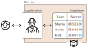
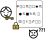
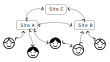

Motivation
==========

Anthropic claims that their Mythos model will greatly simplify and automate
vulnerability scanning of internet-based services including finding previously
unknown zero-day vulnerabilities.
While these claims should be treated with a degree of skeptisism
both in terms of cost and capabilities,
the consensus is that there are no fundamental issues to the approach,
this ability will likely be achieved in future iterations.

<!-- references
    Mythos Release
    https://hacks.mozilla.org/2026/05/behind-the-scenes-hardening-firefox/
    https://daniel.haxx.se/blog/2026/05/11/mythos-finds-a-curl-vulnerability/
-->

These capabilites will greatly reduce the costs of breaking into
and hacking computer systems.
Attacks that occur every now and again will become more prevalent.
These include ransomware,
stealing and exploiting confidential data,
and denial of service attacks.
Systems that previously got away by simply not being a priority to attackers
now become vulnerable.

These attacks are not just a minor IT nuisance but rather of national importance.
Consider state-actors that at times of peace collect and catalog vulnerabilities
across systems that are individually seemingly unimportant---education
records, healthcare data, traffic management, and exploit
them as leverage during not-so-peaceful times.

Small- and medium-scale institutions struggle to manage their own IT infrastructure.
When they outsource it to an outside firm it is difficult
to evaluate and access the quality of their setup.
For example, you may find out you cannot restore a backup only during a crisis.

We'd like to work on a product that employs formal techniques to provide secure
yet easy to deploy services.
Through putting together a few tried and tested technologies,
we can make robust and secure services easier to deploy.
These technologies take a "secure-by-design" approach---security is achieved
not by starting with an insecure design and then bolting on top mechanisms
to keep out attackers, but rather they completely avoid insecurities.
E.g. A bank vault is built without windows from the start,
rather than installing security bars on windows.
At the same time, existing security approaches may be used on top (e.g. operating
within a VPN) allowing a defense-in-depth approach.

Methodology
===========

In traditional services, data is stored in plain text on the server,
and the application acts as a gatekeeper,
allowing valid requests and denying unauthorized ones.
However, if an unauthorized agent gains access to the server, they have free reign
to view and modify the data.

In our model, access-controlled data is encrypted. This means that even if
someone is able to break into the server there is little they can do with it.
Authorized users, however, have a key to decrypt the data. This key is kept
securely on their device, and unlocked using biometrics or a PIN.
It never leaves the device.

Our model uses a distributed architecture.
This has several advantages.
For example, each server may keep a complete copy of the data, and so act as a backup.
Restoring data from backups is no different from ordinary node-to-node synchronization,
so is much less risky than in the traditional model.
Multiple "blessed" servers may also be used to help in load sharing or
to improve geographical locality of data.
Users may easily make changes offline and later synchronize with a server
or even another user.

We employ a powerful cryptographic structure, called the *Merkle tree*,
that ensures the correctness of our data and makes any tampering or
unauthorized modifications obvious and traceble.
This structure is the foundation of the Git VCS and blockchain-based systems.

---

Let us enumerate some of these technologies.

Distributed, tamper-proof ledgers.
:   This is the technology underlying Blockchains and the Git VCS.
    It allows replicated storage of an application at different sites.
    Each site also acts a partial or complete backup with no additional work.
    The computational resources may also be split across different sites allowing for load-sharing.
    Certain applications allow end-users to share some of the infrastructural burden
    and so scale with little additional infrastructure per user.
    At the same time, data is cryptographically signed making it obvious
    when tampering occurs.

End-to-end encryption
:  allows access to data on a strictly need-to-know basis, through encryption.
   While originally intended for privacy it can also be employed for
   security---attackers would need to gain access to not just the encrypted
   data but also the keys used for deciphering them.

Passkeys
:  ease the management of cryptographic keys for end-users,
   and eliminate insecure and difficult to remember passwords.
   Instead cryptographic keys are tied to a user's device (phone, laptop, security fob)
   and can be used for authorization via a fingerprint or PIN.

Applications
============

Website hosting
:   Organizations tend to use a unnecessarily complex systems to host websites.
    For example, WordPress is often used where a static website would suffice.
    This employs a MySQL database with a large attack surface.

Sensitive Data Collection
:   End-to-end encryption may be used for compliance with privacy standards,
    e.g. in healthcare.

Document management
:   Distributed editing of documents. Offline editing. Version tracking.

Public Records
:   Records (e.g. Public Land Records) where seeing modification history
    and authorization is needed.

Other Features
==============

- offline access
- data-sovereignity: end-users may keep copies of data making archiving easy.

Our expertise
=============

- Formal Methods--using mathematical tools to prove the correctness of a system.
- Git & Blockchains: Tools that make use of distributed ledgers.
- Devops

